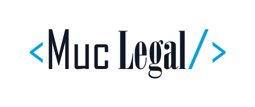
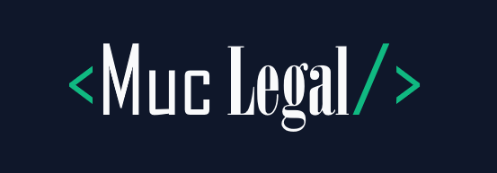

<p align="center">
  
</p>

# MucLegal

## Für alle, die das Problem verstehen wollen

### Worum geht es?

Wenn ein Unternehmen eine rechtswidrige Geschäftspraxis unterlassen muss, ist der Fall damit noch nicht unbedingt erledigt. Dieselbe Praxis kann später in leicht veränderter Form wieder auftauchen – zum Beispiel auf einer anderen Unterseite, im Warenkorb oder mit einer neuen Formulierung.

Ein einfacher Textvergleich übersieht solche Varianten häufig. MucLegal unterstützt deshalb bei der entscheidenden Frage: **Ist die neue Darstellung im Kern derselbe bereits untersagte Verstoß?** Juristisch spricht man von einer kerngleichen Verletzungsform.

### Was macht MucLegal?

MucLegal beobachtet öffentlich erreichbare Webseiten und dokumentiert nachvollziehbar, wenn sich eine rechtlich relevante Aussage ändert:

1. Die Seite wird abgerufen und der unveränderte Ausgangszustand wird lokal gesichert.
2. Unwichtiges Seitenrauschen wie Cookie-Hinweise oder laufende Countdown-Zahlen wird ausgeblendet.
3. Eine echte Textänderung wird sichtbar hervorgehoben.
4. Eine KI erstellt eine begründete juristische Vorprüfung anhand des hinterlegten Unterlassungstenors.
5. Die zugehörigen Dokumentationsartefakte werden mit Prüfsummen, Webarchiv und Zeitstempel gesichert.
6. Ein Mensch prüft das Ergebnis und trifft die abschließende Entscheidung.

MucLegal entscheidet also **nicht selbst über einen Rechtsverstoß**. Die Software bereitet den Fall strukturiert auf und macht die Prüfung schneller und nachvollziehbarer.

### Für wen ist das gedacht?

- Verbraucherzentralen und Wettbewerbsverbände
- Industrie- und Handelskammern
- Kanzleien und Rechtsabteilungen
- Stellen, die die Einhaltung von Unterlassungserklärungen kontrollieren

### Was kann der aktuelle Stand bereits?

Die Demo enthält einen menschlich freizugebenden Tenor-Entwurf sowie zwölf künstlich
erstellte und klar gekennzeichnete Prüfszenarien. Zwei davon bilden den kurzen Golden Path:

- **Im Kern wiederholter Verstoß:** Die Formulierung hat sich geändert, die beanstandete Wirkung bleibt jedoch gleich.
- **Nicht vom Verbot umfasst:** Die neue Darstellung fällt nach der Vorprüfung nicht unter den hinterlegten Tenor.

Neben den reproduzierbaren Offline-Szenarien kann der Monitor echte öffentliche URLs abrufen,
normalisieren, als Full-Page-Screenshot dokumentieren und bei einer späteren Änderung live durch
Anthropic vorprüfen lassen. Auf einer einzigen Prüfseite werden Änderung, KI-Begründung,
Unsicherheit und lokale Dokumentationsartefakte gezeigt. Die menschliche Entscheidung wird davon
getrennt erfasst.

### Welche Grenzen gelten?

MucLegal arbeitet ausschließlich mit öffentlich zugänglichen Seiten. Es umgeht keine Logins, Paywalls, CAPTCHAs oder technischen Schutzmaßnahmen und respektiert `robots.txt`. Rohdaten und Dokumentationsartefakte werden nicht zur Analyse an fremde Extraktionsdienste weitergegeben.

Der aktuelle Stand ist ein Hackathon-Prototyp und noch kein autonomes Produktivsystem. Insbesondere gibt es keine Benutzerverwaltung, kein Mehrmandanten-Dashboard, keine visuelle Screenshot-Analyse und keine automatische rechtliche Freigabe.

---

<p align="center">
  
</p>

# Technischer Teil

## Funktionsumfang

Der aktuelle Golden Path umfasst:

- kontrollierten HTTP-Abruf mit identifizierbarem User-Agent, Timeout und begrenzten Wiederholungen
- Prüfung von `robots.txt` und Abbruch bei Login-, CAPTCHA- oder Blockseiten
- lokale Ablage von HTML, Response-Headern, Zeitpunkten und Snapshot-Metadaten
- Playwright-Full-Page-Screenshot mit eigenem SHA-256-Hash und Vorschau im Proof-Panel
- deterministische NFKC-Normalisierung mit `trafilatura` und eng begrenzten CSS-Regeln
- klauselscharfer Split, Klausel-Hashes und strukturelle Zuordnung von Umformulierungen
- SHA-256-Hashvergleich, Text-Diff und Sicherheitsabbruch bei verdächtig kurzer Extraktion
- schema-validierte juristische Vorprüfung mit Offline-Fixtures oder Anthropic
- Vierklassen-Validierung mit wörtlichem Belegzitat und `unsicher`-Fallback
- WARC/CDX-Erzeugung und Validierung mit `warcio`
- Hash-Manifest und RFC-3161-Zeitstempel mit dokumentiertem Offline-Fallback
- PDF-Prüfbericht und eine FastAPI-Ein-Seiten-Ansicht
- getrennte Speicherung von Modellbewertung und menschlicher Freigabe
- SQLite-erzwungene Append-only-Regeln für Befunde und Dokumentationspakete
- versionierte REST-Schnittstelle unter `/api/v1/`
- versionierte Eval-Suite mit maschinenlesbarem und fachlichem Bericht

Eine technische Übergabe mit Architektur, Datenflüssen, Befehlen und offenen Punkten steht in
[`CONTEXT.md`](CONTEXT.md).

## Voraussetzungen und Installation

Benötigt werden Python 3.11 oder neuer und Git. Für die vollständige Beweiskette werden GNU Wget und OpenSSL benötigt; unter Windows verwendet das Projekt bevorzugt GNU Wget über WSL.

```powershell
python -m venv .venv
.venv\Scripts\python -m pip install -e ".[demo]"
.venv\Scripts\python -m playwright install chromium
```

Für die Offline-Demo ist kein API-Schlüssel erforderlich. Die optionale Live-Vorprüfung benötigt `ANTHROPIC_API_KEY`.

## Lokaler Unterlassungs- und Umsetzungsmonitor

Die Ein-Seiten-Oberfläche führt vom Tenor-Entwurf über die Überwachung bis zur menschlichen
Entscheidung. Sie akzeptiert genau eine öffentliche Webadresse. Der erste Abruf speichert
nur eine kostenlose Baseline. Erst wenn ein späterer Abruf eine relevante Änderung erkennt,
werden Anthropic und anschließend die Beweiskette gestartet.

Den Schlüssel ausschließlich in der lokalen Serverumgebung setzen. Er wird nicht im Browser
eingegeben und darf nicht in das Repository geschrieben werden:

```powershell
$env:ANTHROPIC_API_KEY = Read-Host -MaskInput "Neuer Anthropic API-Key"
python -m uvicorn app:app --host 127.0.0.1 --port 8000
```

Danach `http://127.0.0.1:8000` öffnen, eine öffentliche URL eintragen und die erste Baseline
anlegen. Bei einem späteren erneuten Klick gilt:

- unveränderter Hash: Ende ohne Anthropic-Aufruf,
- veränderter Hash: Vorher-/Nachher-Ausschnitt, Anthropic-Vorprüfung, WARC, Manifest,
  RFC-3161-Zeitstempel und PDF,
- Login, CAPTCHA, `robots.txt`-Verbot oder interne Adresse: sicherer Abbruch.

Zum Start ist der synthetische Tenor aus `fixtures/tenor.json` aktiv. In der Oberfläche kann
aus belegten Tatsachen ein strikt validierter Prüfentwurf erzeugt werden. Erst eine menschliche
Freigabe speichert ihn als aktiven Monitoring-Tenor; der Modelloutput selbst kann dies nicht.
Rohes HTML und Dokumentationsartefakte bleiben lokal; nur der normalisierte Änderungsausschnitt wird an
Anthropic gesendet. Laufdaten liegen im ignorierten Verzeichnis `.muclegal-ui/`.

Die linke Seite zeigt den juristischen Ablauf und den technischen Pipeline- und Hashstatus. In der intern
scrollbaren Proof-Seitenleiste lassen sich alle vollständigen Dokumentationspakete nach URL und Zeitpunkt
auswählen. Text-, JSON-, Diff- und HTML-Artefakte werden als ungefährlicher Quelltext angezeigt;
PDFs können eingebettet betrachtet, WARC/CDX und große Binärdateien heruntergeladen werden. Die
Desktop-App-Shell füllt das Browserfenster aus, ohne dass das Dokument selbst scrollt. Sie bleibt
ein Hackathon-Prototyp und ist keine öffentliche oder autonome Rechtsberatungsoberfläche.

## Schnellstart: vollständige Offline-Demo

Der folgende Befehl startet eine lokale Fixture-Seite, erzeugt Vorher- und Nachher-Snapshots, führt die Offline-Vorprüfung aus und erstellt das Beweispaket samt PDF:

```powershell
python -m muclegal demo --case kerngleich --store .muclegal-demo --report output/pdf/demo-pruefbericht.pdf
```

Alternativ steht der Gegenfall zur Verfügung:

```powershell
python -m muclegal demo --case nicht-umfasst --store .muclegal-demo --report output/pdf/demo-pruefbericht.pdf
```

Anschließend wird die Prüfoberfläche gestartet:

```powershell
python -m uvicorn app:app --host 127.0.0.1 --port 8000
```

Die Ansicht ist danach unter `http://127.0.0.1:8000` erreichbar.

## Eine einzelne URL prüfen

Der `check`-Befehl deckt Abruf, Normalisierung, Speicherung und Änderungserkennung ab. Für einen lokalen Test kann zuerst ein Fixture-Server gestartet werden:

```powershell
python -m http.server 8765 --directory fixtures
```

In einem zweiten Terminal:

```powershell
python -m muclegal check --url http://127.0.0.1:8765/baseline.html --profile fixtures/demo-profile.json --store .muclegal
```

Bei einer echten öffentlichen URL speichert `--screenshot` zusätzlich einen mit
Playwright gerenderten Full-Page-Screenshot samt eigenem SHA-256-Hash:

```powershell
python -m muclegal check --url https://example.com/ --profile fixtures/public-smoke-profile.json --store .muclegal --screenshot
```

Der erste Lauf legt eine Baseline an. Weitere Läufe liefern als JSON unter anderem den aktuellen Hash, den Vorgänger-Hash, den Diff-Pfad und `needs_review`. Bei identischem Hash wird keine juristische Vorprüfung angestoßen.

Die CSS-Unterstützung ist absichtlich eng gehalten. Zulässig sind einfach prüfbare Selektoren wie `main`, `#cookie-banner`, `.countdown` oder `div.notice`. Ein Include-Selektor muss genau einen Knoten treffen.

## Versionierter API-Vertrag

Die Backend-Schnittstelle liegt unter `/api/v1/`. Verfügbar sind insbesondere
`/api/v1/runs`, `/api/v1/cases` und `/api/v1/tenor-drafts`; die interaktive
Schnittstellendokumentation läuft lokal unter `/api/v1/docs`. Die bisherigen
unversionierten `/api/...`-Pfade bleiben vorerst als kompatible Aliase bestehen.

## Juristische Vorprüfung

LLM-Aufrufe sind in `muclegal/llm/` gekapselt. Jeder Output wird gegen ein festes Schema validiert. Ungültige oder fehlende Antworten werden gespeichert, aber nicht als Bewertung freigegeben. `freigabe_durch_mensch` muss bis zur menschlichen Entscheidung `null` bleiben.

Der Offline-Modus verwendet gekennzeichnete Fixtures. Der Live-Adapter nutzt `claude-sonnet-5` und benötigt einen gesetzten Anthropic-Schlüssel.

## Eval-Auswertung

Die versionierte Eval-Suite prüft beide juristischen Demo-Fälle gegen feste Qualitäts-Gates:

```powershell
python -m muclegal eval --suite fixtures/eval-suite.json --output output/eval
```

Erzeugt werden:

- `eval-results.json` für die maschinelle Auswertung
- `eval-report.md` für die fachliche Sichtung

Gemessen werden Schema-Validität, erwartetes Ergebnis, Begründung, stärkstes Gegenargument und die weiterhin ausstehende menschliche Freigabe. Prompt-Version und Prompt-SHA-256 werden im Bericht festgehalten und durch einen Regressionstest geschützt.

Mit gesetztem `ANTHROPIC_API_KEY` läuft dieselbe Suite live:

```powershell
python -m muclegal eval --suite fixtures/eval-suite.json --output output/eval-live --live
```

Die Suite enthält zwölf synthetische Fälle aus Startseite, PDP, Checkout, Newsletter und
weiteren Grenzsituationen. Die Offline-Antworten sind Erwartungs-Fixtures und keine Aussage über
Modellgenauigkeit. Für zwei voneinander unabhängige juristische Blindprüfungen werden Prüfbögen
ohne erwartete Ergebnisse erzeugt:

```powershell
python -m muclegal blind-review --suite fixtures/eval-suite.json --output output/legal-review
```

Bis beide Prüfbögen ausgefüllt und abgeglichen sind, bleibt dieser fachliche Gate ausdrücklich offen.

## Tests

```powershell
python -m pytest -q
```

Die Tests decken unter anderem stabile Hashes, Countdown- und Cookie-Rauschen, relevante Änderungen, HTTP-Fehler, Timeouts, Login-/CAPTCHA-Abbruch, Schemafehler, TSA-Ausfälle, WARC-Validierung, PDF-Bericht, UI-Freigabe und Eval-Gates ab.

## Projektstruktur

```text
muclegal/
  fetch/          konservativer HTTP-Abruf und Playwright-Screenshot
  normalize/      Extraktion, NFKC-Normalisierung, Klausel-Split und Hashes
  storage/        SQLite, Snapshot-Artefakte und Append-only-Befunde
  llm/            Tenor-Entwurf, Vorprüfung und strikte Schema-Validierung
  evidence/       WARC, Manifest, Zeitstempel, Screenshot und PDF
  templates/      Ein-Seiten-Prüfoberfläche
fixtures/         synthetische Demo- und Eval-Fälle
tests/            automatisierte Abnahme- und Regressionstests
app.py            FastAPI-Einstiegspunkt
```

## Verlässlichkeit der Dokumentationskette

Rohes HTML, Header, normalisierter Text, Screenshot, Diff sowie Modellinput und -output werden lokal gespeichert und über ein Manifest miteinander verknüpft. Das WARC wird nach der Erstellung mit `warcio check -v` validiert. Der Manifest-Hash kann über RFC 3161 gestempelt und anschließend lokal geprüft werden.

WARC und Primärsnapshot tragen getrennte Payload-Hashes. Nur bei Bytegleichheit wird
`capture_relation: exact_payload` ausgewiesen; eine abweichende Wiederholungsaufnahme erzeugt
eine Warnung. Ist freeTSA oder die optionale Wayback-Sicherung nicht erreichbar, bleibt dieser
Status sichtbar offen. Die lokal erzeugten Artefakte und Hashes bleiben dennoch vollständig.

Für einen echten Wayback-SPN-Aufruf können `WAYBACK_ACCESS_KEY` und `WAYBACK_SECRET_KEY` nur in
der lokalen Serverumgebung gesetzt werden. Ohne diese Variablen wird der Schritt sofort als
`not_configured` dokumentiert und blockiert die Demo nicht.

Der im synthetischen Fixture enthaltene Vertragsstrafen-Richtwert ist kein gesetzlicher oder
automatisch empfohlener Betrag. Vertragsstrafe, gerichtliche Ordnungsmittel und die rechtliche
Reichweite eines Tenors werden immer getrennt und menschlich geprüft.
