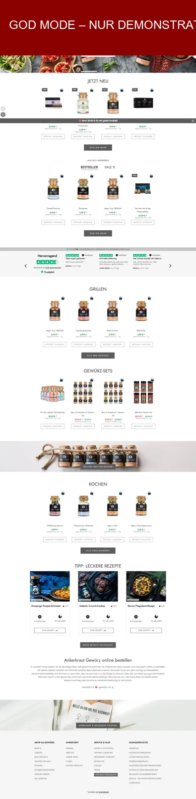
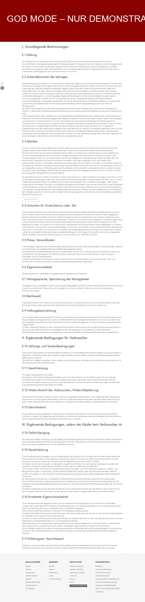

# BeweisLab: Modi und technischer Erfassungsweg

## Welche Verstöße lassen sich gut dokumentieren?

Das BeweisLab eignet sich besonders für Inhalte, die auf öffentlichen Webseiten
sichtbar sind, zum Beispiel:

- AGB und andere Vertragsklauseln,
- Preis-, Laufzeit- und Kündigungsangaben,
- Werbeaussagen und Garantieversprechen,
- öffentlich sichtbare Buttons und Links,
- AGB- und Datenschutzseiten.

Nur eingeschränkt geeignet sind Inhalte hinter einem Login, mehrstufige
Bestell- oder Kündigungsabläufe, Apps sowie Verstöße, die nur anhand der
optischen Gestaltung beurteilt werden können.

## Was macht das BeweisLab?

Das BeweisLab hält den öffentlich erreichbaren Zustand einer Webseite
technisch nachvollziehbar fest. Es dokumentiert außerdem, wenn eine Seite nicht
oder nur teilweise erfasst werden konnte.

Es bewertet nicht, ob ein Rechtsverstoß vorliegt oder ob zwei Darstellungen
juristisch kerngleich sind. Diese Prüfung wird separat dokumentiert.

## Die Betriebsarten

### Standardmodus

Das BeweisLab versucht zunächst einen direkten öffentlichen Abruf der
eingegebenen URL. Dabei werden `robots.txt` und technische Zugangshindernisse
beachtet.

Logins, Paywalls und CAPTCHAs werden nicht überwunden.

### Automatische Überprüfung

Diese Einstellung ist standardmäßig aktiv. Ergibt der direkte Abruf nur eine
JavaScript-Hülle oder einen tatsächlichen Schutzhinweis, darf das BeweisLab die
Seite einmalig in einem normalen Browser laden.

Der Browser verwendet keine Tarntechnik, keinen Proxy und kein dauerhaftes
Nutzerprofil. Vor einem Screenshot darf höchstens eine eindeutig
datensparsame Cookie-Auswahl wie „Alle ablehnen“ oder „Nur notwendige“ betätigt
werden. Eine Zustimmung wird nicht erteilt.

### Ohne automatische Überprüfung

Ist die automatische Überprüfung ausgeschaltet, wird nach einer
JavaScript-Hülle oder einem Schutzbefund kein Browser-Abruf gestartet.

Öffentlich erreichbare Rechtstext-Unterseiten können weiterhin direkt geprüft
werden. Die nicht erfasste Hauptseite wird als technische Grenze dokumentiert.

### Grey Mode

Der Grey Mode gilt nach ausdrücklicher Aktivierung für alle Systeme. Aktivierung,
Berechtigungsgrundlage, Ziel und verwendete Funktionen werden protokolliert.

Spezielle Disclaimer oder Hinweise sind optional und werden vom Nutzer bestimmt.
Grey-Mode-Artefakte sollten von regulären Beweisen unterscheidbar bleiben.

Auch im Grey Mode bleiben die Nutzung fremder Zugangsdaten, die Überwindung von
Logins oder Paywalls, das Lösen von CAPTCHAs, die Ausnutzung von Schwachstellen
und Identitätstäuschung ausgeschlossen.

## Beispielpaket: Ankerkraut im Grey Mode

Das folgende reale Demopaket wurde am 21.08.2026 für
`https://www.ankerkraut.de/` erzeugt. Es zeigt, welche technischen Unterlagen
das BeweisLab grundsätzlich zusammenstellen kann.

Das Beispielpaket entstand vor der Umbenennung und kann deshalb noch die frühere
Kennzeichnung enthalten. Nach aktueller Vorgabe sind solche Hinweise optional
und werden vom Nutzer bestimmt.

Der Gesamtstatus des Beispielpakets lautet **teilweise erfasst**. Eine
gefundene Rechtstextübersicht konnte nicht in jedem Punkt eindeutig einer
konkreten Klauselseite zugeordnet werden. Diese Grenze blieb im Paket sichtbar
und wurde nicht als vollständige Erfassung ausgegeben.

Das Paket enthält unter anderem:

- Aufnahme der Hauptseite,
- gesonderte AGB- und Datenschutzansichten,
- Roh-HTML und Serverinformationen,
- aufbereiteten Text und einzelne Klauseln,
- Protokoll der Browser- und Cookie-Interaktionen,
- WARC-Webarchiv und CDX-Index,
- SHA-256-Manifest,
- Zeitstempelstatus,
- PDF-Prüfbericht.

### Hauptseite

Die rote Kennzeichnung ist Bestandteil der Demonstrationsaufnahme und macht
den Sonderstatus unmittelbar sichtbar.



### AGB-Ansicht

Die AGB wurden als eigene Rolle aufgenommen. Dieses ältere Bild trägt noch die
frühere Kennzeichnung; der Grey-Mode-Status sollte von einer regulären
Beweisaufnahme unterscheidbar bleiben.



Für die Weitergabe in Google Drive müssen die Markdown-Datei und die beiden
WebP-Bilder gemeinsam in denselben Ordner hochgeladen werden. Dann bleiben die
relativen Bildverweise erhalten.

## Wie wählt das BeweisLab den Erfassungsweg?

```text
Öffentliche URL eingeben
→ URL und Zielsystem technisch prüfen
→ robots.txt prüfen
→ Seite direkt abrufen
→ Inhalt ausreichend?
   ├─ Ja: Inhalt aufbereiten und Beweise sichern
   └─ Nein: JavaScript-Hülle oder Seitenschutz unterscheiden
             → automatische Überprüfung aktiv?
                ├─ Ja: einmalig im normalen Browser laden
                └─ Nein: Grenze dokumentieren
→ öffentliche AGB- und Datenschutzseiten immer berücksichtigen
  (auch wenn Hauptseite, Browser oder Grey Mode scheitern)
→ Text normalisieren und SHA-256-Prüfwert bilden
→ Screenshots und technische Begleitdaten sichern
→ Ergebnis und verbleibende Grenzen ausgeben
```

Das BeweisLab probiert nicht beliebig viele technische Wege aus. Kann auch der
zulässige Browser-Abruf keinen auswertbaren Inhalt liefern, wird der Lauf mit
einem Schutz- oder Fehlerbefund beendet. Vorher werden noch begrenzt öffentliche
AGB- und Datenschutzpfade geprüft. Die geprüften Ziele und ihre Fehler stehen im
Paket. Eine fehlgeschlagene Erfassung wird nicht als erfolgreiche Aufnahme
dargestellt.

Für zwei bekannte Websites werden unabhängig vom Startpfad immer zuerst feste
öffentliche AGB-Ziele berücksichtigt:

- Temu: `https://www.temu.com/de/terms-of-use.html`
- Adidas: `https://www.adidas.de/terms_and_conditions`

Bei Temu wird zusätzlich
`https://www.temu.com/de/privacy-policy.html` als bekanntes Datenschutzziel
aufgenommen. Diese feste Zielauswahl ersetzt keine Robots- oder Schutzprüfung;
sie verhindert lediglich, dass die richtige öffentliche URL übersehen wird.

## Welche Technik wird verwendet?

Kurz zusammengefasst:

- direkter HTTP-Abruf für öffentlich erreichbare Seiten,
- Playwright mit Chromium für den einmaligen Browser-Abruf,
- Normalisierung zur Entfernung typischer flüchtiger Seitenelemente,
- SHA-256 als digitaler Fingerabdruck der gespeicherten Inhalte,
- Screenshots der Hauptseite sowie, soweit erreichbar, von AGB und Datenschutz,
- WARC/CDX als lokales Webarchiv,
- Manifest mit Prüfsummen aller enthaltenen Dateien,
- optionaler RFC-3161-Zeitstempelversuch.

Rohes HTML, Serverinformationen, WARC und Screenshots werden lokal erhoben und
nicht über eine fremde Extraktions-API geleitet.

## Wie wird das Ergebnis bezeichnet?

| Ergebnis | Bedeutung |
|---|---|
| **Als technischer Beleg verwendbar** | Die öffentliche Seite und die wesentlichen technischen Dateien wurden regulär erfasst. Eine rechtliche Verwertbarkeit wird damit nicht garantiert. |
| **Nur eingeschränkt verwendbar** | Teile der Erfassung sind vorhanden, aber einzelne Ansichten oder Prüfungen fehlen. |
| **Nicht als Beleg verwendbar – nur Hinweis** | Erfasst wurde nur ein Schutz- oder Fehlerzustand. |
| **URL nicht erfassbar** | Es konnte kein regulärer öffentlicher Seiteninhalt aufgenommen werden. |

Ein Grey-Mode-Lauf ist nicht allein wegen des Modus als unverwertbarer Hinweis
einzustufen. Seine Einordnung richtet sich nach dem konkret erfassten Zustand; der
Modus sollte für Nutzer weiterhin von einer regulären Erfassung unterscheidbar sein.

## Wichtigste Grenzen

- Das BeweisLab dokumentiert Technik, nicht Recht.
- Eine nicht gefundene Information beweist nicht automatisch, dass sie auf der
  gesamten Website fehlt.
- `robots.txt`, Login, Paywall, CAPTCHA oder Seitenschutz können die Erfassung
  begrenzen.
- Screenshots werden nicht automatisch inhaltlich oder optisch bewertet.
- Dynamische, personalisierte oder regionale Seiten können bei einem anderen
  Abruf anders aussehen.
- Externe Textdienste können Hinweise liefern, ersetzen aber keine lokale
  Beweisaufnahme.

Die juristische Kerngleichheitsprüfung und die menschliche Freigabe sind nicht
Teil dieser Übersicht und werden separat beschrieben.
